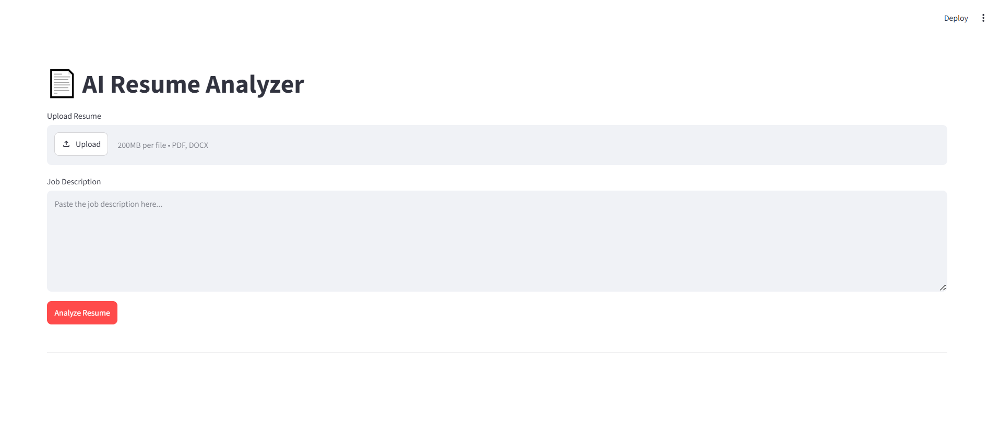

# 📄 AI Resume Analyzer

> **An AI-powered ATS (Applicant Tracking System) resume analyzer that compares a resume against a job description — across any professional field (IT, Engineering, Healthcare, Marketing, etc.) — and reports a match score, matched/missing skills by category, and improvement suggestions.**

---
## Main screen


---

## ✨ Features

| Feature                             | Description                                                                                                                                                               |
| ----------------------------------- | ------------------------------------------------------------------------------------------------------------------------------------------------------------------------- |
| **Domain-agnostic skill analysis**  | Dynamically detects the job's professional domain and generates relevant skill categories using AI, instead of relying on a fixed IT-only skill list.                     |
| **Hybrid ATS score**                | Combines skill-match percentage with overall text similarity (TF-IDF cosine similarity) for a realistic match score.                                                      |
| **Category-wise skill breakdown**   | Matched and missing skills are grouped into meaningful categories (e.g. Programming Languages, Safety Certifications, Software Tools) specific to the job's field.        |
| **Confidence-aware AI enhancement** | When the offline (rule-based) analysis has low confidence, an optional AI-powered deeper analysis (via Gemini) is available with more accurate, personalized suggestions. |
| **Document validity check**         | Flags uploads that don't look like a resume, instead of silently producing a meaningless report.                                                                          |
| **Resilient error handling**        | Gracefully degrades (e.g. still shows the ATS score) if the AI service is unavailable or rate-limited.                                                                    |

---

## 🧠 How It Works

```text
Resume (PDF/DOCX) ─┐
                   ├─► Extract & clean text
Job Description ───┘
                   │
                   ├─► AI generates domain + skill categories for this job
                   │
                   ├─► Skill matching (rule-based, offline, free)
                   ├─► Cosine similarity scoring
                   ├─► Confidence level calculation
                   │
                   └─► Results: score, matched/missing skills, suggestions
                              │
                              └─► Optional: AI-Enhanced deeper analysis
```

---

## 🛠️ Tech Stack

| Layer            | Technology                                                                                                                                                                     |
| ---------------- | ------------------------------------------------------------------------------------------------------------------------------------------------------------------------------ |
| **Frontend**     | Streamlit                                                                                                                                                                      |
| **Backend**      | Python                                                                                                                                                                         |
| **NLP/Matching** | Regex-based skill matching with custom normalization (suffix stripping, alias resolution, compound-word handling), scikit-learn (TF-IDF + cosine similarity), NLTK (stopwords) |
| **AI**           | Google Gemini API (`gemini-flash-latest`) for dynamic skill-schema generation and enhanced analysis                                                                            |
| **File Parsing** | pdfplumber (PDF), python-docx (DOCX)                                                                                                                                           |

---

## 📂 Project Structure

```text
resume_analyzer/
├── modules/
│   ├── main.py                Orchestrates the full analysis pipeline
│   ├── parser.py              Extracts text from PDF/DOCX resumes
│   ├── cleaner.py             Cleans and normalizes text
│   ├── schema_generator.py    AI-generated domain + skill categories
│   ├── keywords.py            Skill matching logic
│   ├── scorer.py              Cosine similarity scoring
│   ├── suggestions.py         Rule-based improvement suggestions
│   └── generator.py           AI-enhanced deeper analysis
├── frontend/
│   └── app.py                 Streamlit UI
├── requirements.txt
└── .env                       (not committed — holds GEMINI_API_KEY)
```

---

## 🚀 Setup & Installation

### 1. Clone the repository

```bash
git clone https://github.com/fakhur29/AI_Resume_analyzer.git
cd AI_Resume_analyzer
```

### 2. Create and activate a virtual environment

```bash
python -m venv .venv
.venv\Scripts\activate      # Windows
source .venv/bin/activate   # macOS/Linux
```

### 3. Install dependencies

```bash
pip install -r requirements.txt
```

### 4. Add your Gemini API key

Create a `.env` file in the project root:

```text
GEMINI_API_KEY=your_api_key_here
```

Get a free key at [Google AI Studio](https://aistudio.google.com/).

### 5. Run the app

```bash
streamlit run frontend/app.py
```

---

## 📖 Usage

1. Upload a resume (PDF or DOCX).
2. Paste the job description.
3. Click **Analyze Resume** to get the offline (rule-based) report — instant and free.
4. If the offline analysis shows **Low confidence**, click **✨ AI Enhance** for a deeper, AI-powered semantic analysis with personalized suggestions.

---

## ⚠️ Known Limitations

* AI-based category generation depends on the Gemini API; on the free tier, requests are rate-limited (the app falls back to showing just the similarity score if this happens).
* The AI's exact category naming can vary slightly between runs of the same job description.
* Skill matching is regex/normalization-based rather than full semantic NLP, so it may occasionally miss uncommon skill phrasing.
